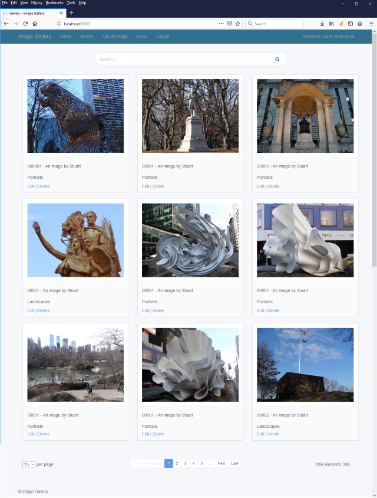

# ImageGallery.Client

[](https://hub.docker.com/r/stuartshay/imagegallery-client/)
[](https://greenkeeper.io/) [](https://codeclimate.com/github/stuartshay/ImageGallery.Client/maintainability)

[](http://sonar.navigatorglass.com:9000/dashboard?id=ImageGalleryClient)
[](http://sonar.navigatorglass.com:9000/dashboard?id=ImageGalleryClient)
[](http://sonar.navigatorglass.com:9000/dashboard?id=ImageGalleryClient)
[](http://sonar.navigatorglass.com:9000/dashboard?id=ImageGalleryClient)


 Jenkins | Status  
------------ | -------------
Base Image (Auth) | [](https://jenkins.navigatorglass.com/job/ImageGallery-Auth/job/ImageGallery-Auth-base/)
Application Image (Auth) | [](https://jenkins.navigatorglass.com/job/ImageGallery-Auth/job/ImageGallery-Auth-build/)
Local Image (Auth) | [](https://jenkins.navigatorglass.com/job/ImageGallery-Auth/job/ImageGallery-Auth-local/)
JS Web Tests (Auth) | [](https://jenkins.navigatorglass.com/job/ImageGallery-Auth/job/ImageGallery-Auth-web-tests/)
SonarQube (Auth) | [](https://jenkins.navigatorglass.com/job/ImageGallery-Auth/job/ImageGallery-Auth-sonarqube/)
AppVeyor |[](https://ci.appveyor.com/project/StuartShay/imagegallery-client)

### About:

Image Gallery Client is a .NET Core WebAPI/Angular Web Application, this project is a front end for managing and categorizing my large collection of New York City Landmarks and Attractions. 




### Demo
```
https://dev.informationcart.com
L: Claire P: password
```

### Prerequisites

```
Node v9.3.0
NET Core SDK 2.1.403
NET Core Runtime 2.1.5
VS Code 1.19.1 or VS 2017 15.8.4
```

### Install & Run

```
cd ImageGallery.Client
dotnet restore

cd src\ImageGallery.Client

npm install

npm run compile-app

dotnet run

http://localhost:8000/
```
#### Build Options 

```
Production: npm run compile-app-prod
Development: npm run compile-app
```
### Cake

Windows 

```
set-executionpolicy unrestricted

.\build.ps1
```

Linux/Mac
```
chmod +x build.sh
"export PATH=\"\$PATH:\$HOME/.dotnet/tools\"" >> ~/.bash_profile
source  ~/.bash_profile

dotnet tool install -g Cake.Tool
dotnet tool list -g
```

```
./build.sh
```

### SonarQube Testing 

```
 .\build.ps1 -target sonar
```

